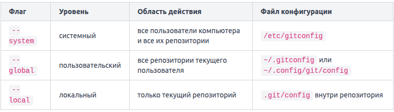
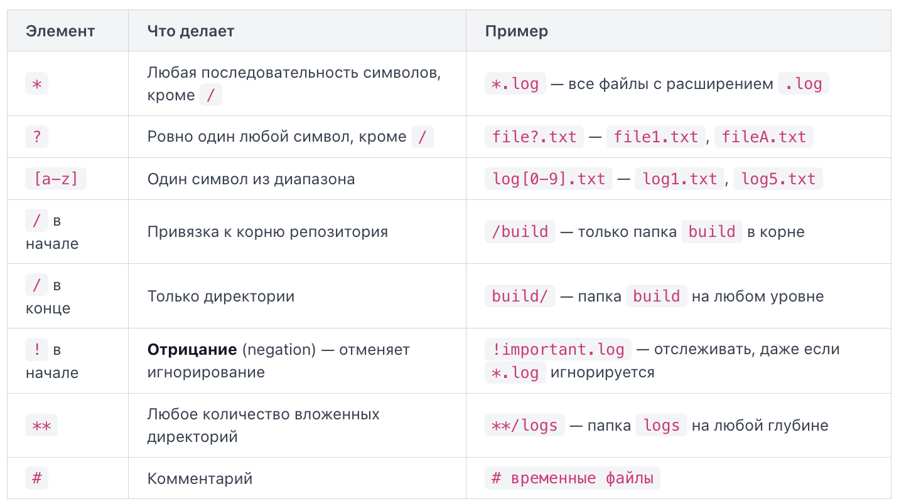
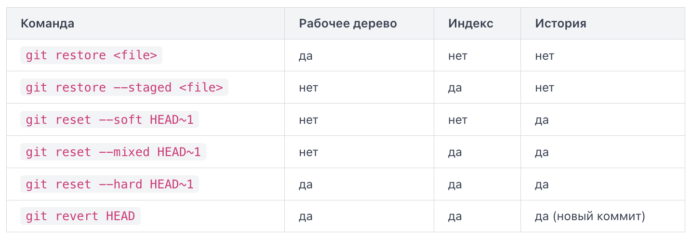
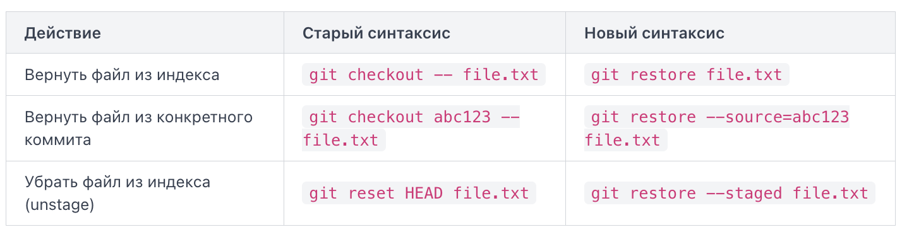
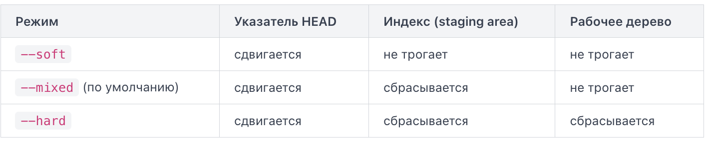

# Виды систем контроля версий (VCS)
Локальная система контроля версий (Local VCS) хранит историю изменений в базе данных на компьютере пользователя. Главный недостаток — отсутствие встроенного механизма совместной работы и обмена изменениями между разработчиками. Поэтому локальная VCS плохо подходит для командной разработки.

Централизованная система контроля версий (Centralized VCS, CVCS) решает проблему совместной работы. Все версии файлов хранятся в центральном репозитории на сервере, а разработчики подключаются к нему для получения и сохранения изменений. Главный недостаток — зависимость от центрального сервера. Если сервер недоступен, разработчики не могут сохранять новые версии в центральный репозиторий.

Распределённая система контроля версий (Distributed VCS, DVCS) не требует постоянной зависимости от центрального репозитория. Каждый участник получает полноценную копию репозитория вместе с его историей. С ней можно работать без доступа к серверу.

# Дельты vs снимки
Любая система контроля версий хранит историю изменений проекта. Но принцип хранения этой истории может различаться. Можно выделить два подхода: хранение дельт (deltas) и хранение снимков (snapshots).

При дельта-ориентированном хранении (delta-based version control) система хранит одну из версий файла, а для последующих версий сохраняет различия между состояниями — дельты. Чтобы получить определённую версию, системе необходимо восстановить её на основе сохранённой версии и соответствующих дельт. Плюс такого подхода — возможность экономить место за счёт хранения только различий между версиями. Минус — восстановление версии может требовать применения одной или нескольких дельт. Чем больше таких зависимостей, тем сложнее может быть восстановление. Конкретные системы могут использовать дополнительные оптимизации, например периодические полные копии.

Git концептуально использует другой подход. Каждый коммит представляет собой снимок состояния проекта в определённый момент времени. Если файл не изменился, Git не создаёт новую копию его содержимого, а повторно использует существующий объект. Благодаря этому каждый коммит однозначно описывает состояние всего проекта.

При этом коммит не содержит внутри себя все файлы проекта. Он ссылается на дерево (`tree`), которое, в свою очередь, содержит ссылки на объекты файлов (`blobs`) и другие деревья. Поэтому правильнее говорить, что коммит представляет полный снимок проекта, а не что он физически содержит полную копию всех файлов.

Важно также, что Git может использовать дельта-сжатие внутри `pack`-файлов для экономии места. Это не меняет концептуальную модель Git: на уровне истории коммиты представляют снимки состояния проекта, а не последовательность дельт, которые необходимо применять для получения каждого следующего состояния.

# Конфигурация
Команда `git config` — основной инструмент для работы с поведением Git. Она позволяет записывать, изменять и читать параметры конфигурации. Настройки хранятся не в одном месте, а на трёх уровнях конфигурации (configuration levels).



По умолчанию команда `git config` изменяет настройки локального репозитория, то есть используется уровень `--local`.

При поиске значения конкретного параметра Git учитывает настройки разных уровней конфигурации. Если один и тот же параметр задан на нескольких уровнях, более специфичный уровень переопределяет менее специфичный.

Git записывает имя автора и email в каждый коммит. Для этого используются параметры `user.name` и `user.email`. Если эти параметры не настроены, Git может попытаться определить имя и email из системных данных, но такое значение может быть некорректным. В зависимости от конфигурации Git также может потребовать явно настроить эти параметры перед созданием коммита.

# Инициализация локального Git-репозитория
`Initialized empty Git repository in /home/user/my-project/.git/` говорит: в указанной директории создан пустой Git-репозиторий (repository) — хранилище метаданных, с помощью которых Git будет отслеживать изменения файлов и хранить историю проекта.

Команда `git init` инициализирует Git-репозиторий в указанной директории. В обычном случае Git создаёт внутри неё скрытую папку `.git`. В ней находятся служебные файлы и каталоги, необходимые Git для работы, в том числе данные об объектах (`objects`) и ссылках (`refs`). Без этих метаданных каталог не является обычным Git-репозиторием.

Существующие файлы проекта при этом не добавляются в отслеживание автоматически. Файлы, которые не исключены правилами `.gitignore`, будут отображаться как `untracked` («неотслеживаемые»).

При инициализации Git создаёт начальную (unborn) ветку. Она пока не указывает ни на один коммит. После создания первого коммита эта ветка начинает указывать на него и получает историю. Имя начальной ветки можно задать непосредственно при инициализации, например `git init -b main`, либо настроить имя по умолчанию с помощью `init.defaultBranch`.

Необязательно сначала переходить в нужную директорию. Путь к ней можно передать непосредственно команде. Если указанной директории ещё нет, Git создаст её и инициализирует внутри неё репозиторий.

# Три области Git
Когда вы работаете с Git, состояние файлов проекта можно рассматривать через три основные области: рабочую директорию, индекс и репозиторий.

Рабочая директория (working tree) — это обычная папка проекта на вашем диске. Git отслеживает файлы в рабочей директории, а изменения, которые ещё не добавлены в индекс, отражены только в рабочей директории и не войдут в следующий коммит.

Область подготовки (staging area), она же индекс (index) — промежуточная область между рабочей директорией и репозиторием. Технически индекс хранится в файле `.git/index` и содержит состояние файлов, подготовленное для следующего коммита.

Репозиторий (repository) — это папка `.git` в корне проекта. Здесь Git хранит объекты, ссылки, метаданные и историю коммитов. Когда вы выполняете `git commit`, Git создаёт новый коммит на основе состояния, представленного в индексе.


# git status
Согласно документации, `git status` отображает три категории путей:

- Различия между индексом (`index`) и последним коммитом -- то, что будет зафиксировано при `git commit`.
- Различия между рабочей директорией (`working tree`) и индексом -- изменения, которые ещё не добавлены через `git add`.
- Файлы, которые Git вообще не отслеживает -- неотслеживаемые файлы (`untracked files`).

Каждый отслеживаемый файл можно описать по двум независимым сравнениям: `HEAD` с `index` и `index` с `working tree`.

- `Untracked`: файл отсутствует в индексе и не отслеживается Git
- `Staged`: изменения файла находятся в `index` и будут включены в следующий `commit`
- `Modified`: Отслеживаемый файл изменён, но изменения не добавлены в `index`
- `Unmodified`: `HEAD`, `index` и `working tree` содержат одну и ту же версию файла.

Состояние `Unmodified` в выводе `git status` не отображается.

`Staged` и `Modified` могут существовать одновременно для одного файла, если изменения файла были добавлены в индекс, а затем файл снова изменён без последующего `git add`.

Команда `git status -s` выводит короткий формат (`short format`). Каждый файл занимает одну строку с двухбуквенным кодом состояния. Буква в левой позиции описывает состояние индекса, в правой состояние рабочей директории: ` M`: изменён только working tree `M `: изменение staged `MM`: staged-изменение + ещё одно изменение в working tree `A `: файл добавлен в index `??`: untracked `D `: файл удалён и это удаление staged ` D`: файл удалён в working tree, но удаление не staged.

---

# Содержимое папки .git
`HEAD` — это файл, который указывает на текущую ветку или непосредственно на конкретный коммит.

`objects` — это база данных вашего репозитория. Здесь Git хранит объекты: содержимое файлов (`blobs`), структуру каталогов (`trees`) и информацию о коммитах (`commits`). Каждый объект получает уникальное имя -- хеш из 40 символов (SHA-1). Как только вы сделаете первый коммит, внутри `objects` появятся папки с двухсимвольными именами (первые два символа хеша), а в них -- файлы с оставшимися 38 символами. Современные Git-репозитории могут использовать SHA-256.

Каталог `refs` (от references -- ссылки) хранит ссылки, указывающие на коммиты. Внутри него обычно лежат подкаталоги:

- `refs/heads/`: Локальные ветки (`main`, `feature` и т.д.)
- `refs/tags/`: Теги -- именованные метки для важных коммитов
- `refs/remotes/`: Удалённые tracking-ветки, например `origin/main`

Локальная ветка в обычном состоянии представлена файлом, внутри которого записан хеш последнего коммита этой ветки.

В обычном состоянии `HEAD` содержит ссылку на текущую ветку в `refs/heads/`, а файл этой ветки содержит хеш последнего коммита. Так Git знает, какой коммит сейчас активен.

Файл `config` -- это локальная конфигурация конкретного репозитория.

Помимо этих четырёх ключевых элементов, в `.git` есть файл `index`. Он хранит состояние файлов, подготовленное для следующего коммита, а также каталог `hooks` со скриптами-хуками, которые Git может запускать автоматически при определённых событиях (например, перед коммитом).

При выполнении `git commit` Git использует `HEAD` для определения текущего положения в истории и создаёт новый коммит с состоянием, представленным в индексе.

Иногда `HEAD` может указывать не на ветку, а напрямую на конкретный коммит. Это состояние называется отсоединённый `HEAD` (detached HEAD). Оно возникает, когда `HEAD` перестаёт указывать на ветку и начинает указывать непосредственно на коммит. В этом состоянии новые коммиты "повиснут в воздухе" -- они не привязаны ни к одной ветке и со временем могут стать недостижимыми и быть удалены Git.

Если передать имя каталога, Git добавит в индекс все новые и изменённые файлы внутри него, включая вложенные подкаталоги. Точка (`.`) означает текущую директорию.

Флаг `-A` (или полная форма `--all`) работает похоже на точку, но с одним ключевым отличием — он всегда охватывает весь репозиторий, независимо от того, в какой папке вы находитесь.

# git commit
Если нужно многострочное сообщение коммита, можно передать несколько `-m` подряд. Каждое значение станет отдельным абзацем. В результате первое значение станет заголовком (`subject`), а второе — первым абзацем тела (`body`); между ними будет пустая строка. Это удобный способ следовать формату «тема + описание», не заходя в редактор.

Флаг `-a` (сокращение от `--all`) говорит Git: «перед коммитом автоматически добавьте в индекс все изменённые и удалённые файлы, которые уже отслеживаются». Это экономит отдельный вызов `git add` для каждого файла.

Важное ограничение: `-a` не затрагивает новые файлы, которые Git ещё не знает (`untracked`). Для них по-прежнему нужен явный `git add`.

На практике `-a` и `-m` часто используют вместе. Флаги можно объединить.

Это эквивалент двух команд:

```git
git add -u
git commit -m "Update styles for header"
```

Команда `git add -u` добавляет в индекс все изменённые и удалённые отслеживаемые файлы -- по сути, это то же обновление индекса, которое выполняет флаг `-a` перед коммитом.

Commit-сообщение обычно состоит из двух частей, разделённых пустой строкой: темы (`subject`) и тела (`body`).

Императивное наклонение (imperative mood) -- это форма глагола-команды. Есть простой тест: подставьте тему в шаблон: _If applied, this commit will <ваша тема>_.

Флаг `--amend` (от англ. "amend" — исправить, внести поправку) заменяет последний коммит новым. Git создаёт новый коммит вместо последнего, а старый коммит перестаёт быть частью текущей ветки.

Если коммит уже сделан, но сообщение неудачное, выполните: `git commit --amend -m "Fix typo in README"`.

Допустим, вы сделали коммит, но забыли включить файл. Флаг `--no-edit` говорит Git: «Оставь сообщение коммита прежним, просто включите новые изменения из `staging area` в новый коммит».

Обычно используйте `--amend` до отправки коммита в удалённый репозиторий. Если коммит уже был отправлен и другие люди успели его получить, `--amend` перепишет историю. Последующий `force push` может создать проблемы для

# git log
Команда `git log` выводит историю коммитов текущей ветки в обратном хронологическом порядке (от самого свежего к самому старому). По умолчанию используется формат `medium`, который содержит хеш коммита, информацию об авторе, дату и сообщение коммита. Чтобы показать только последние N записей, добавьте флаг `-<число>`. `git log -5` = `git log -n 5` = `git log --max-count=5`. Когда коммитов больше, чем помещается на экран, Git открывает вывод в пейджере (pager) — обычно это программа `less`.

Флаг `--oneline` сокращает каждый коммит до одной строки: укороченный хеш и первая строка сообщения. Внутри это сокращение для `--pretty=oneline --abbrev-commit`.

Флаг `--graph` рисует текстовую схему ветвления слева от списка коммитов. Каждая ветка отображается отдельной линией, а точки слияния (merge) обозначаются соединениями линий. Символ `*` обозначает коммит, вертикальные линии `|` показывают параллельные ветки, а косые `/` и `\` — места ответвления и слияния. Флаг `--graph` автоматически включает топологическую сортировку (`--topo-order`), чтобы коммиты не перемешивались между ветками и отображались в порядке, сохраняющем структуру истории.

По умолчанию `git log` показывает историю только текущей ветки. Флаг `--all` включает в вывод историю всех refs, включая локальные и удалённые ветки и теги.

На практике эти три флага часто используют вместе.

Флаг `--author` принимает строку-шаблон (pattern) и показывает только те коммиты, где имя или email автора совпадают с этим шаблоном. Шаблон интерпретируется как регулярное выражение, но для повседневных задач достаточно указать часть имени или email. По умолчанию регистр букв учитывается. Если нужно игнорировать регистр, добавьте флаг `-i`. Если передать несколько `--author`, Git покажет коммиты, подходящие хотя бы под один из шаблонов.

Для ограничения по времени используются два флага:
- `--since=<дата>` (`--after`)
- `--until=<дата>` (`--before`)

Человекочитаемые выражения вроде `"3 days ago"`, `"1 month ago"`, `"last Monday"` тоже работают и очень удобны в ежедневной практике.

# git diff
Команда `git diff` без аргументов сравнивает рабочую директорию и staging area (индекс). Это позволяет увидеть, что вы изменили в файлах, но ещё не добавили через `git add`. Важно: `git diff` без аргументов не видит новые неотслеживаемые файлы (untracked files). Если вы создали новый файл, но ни разу не делали для него `git add`, он не появится в выводе `git diff`. Если в проекте много изменённых файлов, а вас интересует только один, укажите путь после `--`. Разделитель `--` нужен, чтобы Git однозначно воспринимал следующие аргументы как пути к файлам. Можно перечислить несколько путей через пробел или указать целую директорию — тогда `git diff` покажет изменения во всех отслеживаемых файлах внутри неё.

Команда `git diff --staged` показывает разницу между тем, что находится в staging area (индексе), и последним коммитом (`HEAD`). У этого флага есть полный синоним — `--cached`.

`git diff HEAD` сравнивает текущее состояние рабочей директории и индекса с последним коммитом (`HEAD`). Поэтому в вывод попадут как staged-, так и unstaged-изменения.

Первая строка любого блока изменений начинается с `diff --git`.

```git
diff --git a/app.py b/app.py
```

Здесь `a/app.py` — условное имя файла в старой версии, а `b/app.py` — условное имя файла в новой версии. Префиксы `a/` и `b/` — условные метки, а не реальные папки. Даже если файл не переименовывался, Git всё равно показывает оба имени.

После этого идут строки `--- a/app.py` и `+++ b/app.py`, которые указывают, какой файл считается старым, а какой — новым.

Самая важная служебная строка — заголовок фрагмента (hunk header). Он выглядит так:

```git
@@ -3,7 +3,9 @@ def hello():
```

- `-3,7`: в старой версии фрагмент начинается со строки 3 и занимает 7 строк
- `+3,9`: в новой версии фрагмент начинается со строки 3 и занимает 9 строк
- `def hello():`: контекстная подсказка, которую Git добавляет, чтобы показать ближайший подходящий контекст к этому фрагменту, например имя функции или класса

Знак `-` в заголовке относится к старому файлу (`a/`), знак `+` — к новому (`b/`). Если в новой версии фрагмент занимает 9 строк вместо 7, это означает, что в этом фрагменте в новой версии на две строки больше, но само по себе это не означает, что были просто добавлены две строки: часть строк могла быть удалена и заменена другими.

Внутри каждого фрагмента каждая строка начинается с одного из трёх символов:

- Пробел — строка не менялась, показана для контекста (по умолчанию обычно по 3 строки сверху и снизу).
- Минус `-` — строка удалена из старой версии.
- Плюс `+` — строка добавлена в новой версии.

Git не знает, что вы «отредактировали» строку. Если вы поменяли одно слово в строке, diff обычно покажет удаление старой строки целиком и добавление новой целиком. Пара «минус + плюс» подряд часто соответствует изменённой строке. Поэтому обычный diff работает построчно, а не посимвольно.

Когда в выводе несколько файлов, блоки `diff --git ...` идут один за другим. Каждый файл получает свой заголовок и свои фрагменты `@@`. Если в одном файле изменения разбросаны далеко друг от друга, Git покажет несколько фрагментов `@@` подряд — каждый со своими номерами строк.

Часто нужно сравнить два произвольных коммита между собой. Для этого команде передают два хеша коммитов через пробел:

```git
git diff hash1 hash2
```

Git покажет разницу между состоянием файлов в этих двух коммитах. Порядок аргументов важен: `hash1` — это «было», `hash2` — это «стало». Если поменять их местами, строки с `+` и `-` поменяются ролями.

Для `git diff` запись с двумя точками (`hash1..hash2`) также задаёт сравнение содержимого двух указанных коммитов:

```git
git diff hash1..hash2
```

Вместо хеша можно использовать `HEAD` и суффикс `~n`, чтобы не копировать хеши вручную:

- `git diff HEAD~1 HEAD`: сравнить предпоследний коммит с последним
- `git diff HEAD~3 HEAD`: сравнить состояние коммита три поколения назад с последним
- `git diff HEAD~2 HEAD~1`: сравнить два старых коммита между собой    

Суффикс `~n` означает переход на `n` шагов назад по цепочке первых родителей коммита. Для обычной линейной истории это соответствует движению на `n` коммитов назад.

Если в проекте сотни файлов, а вас интересует один конкретный, добавьте путь после `--`. Можно перечислить несколько путей через пробел.


# Ветки
Ветка в Git — это лёгкий подвижный указатель на один из коммитов. В обычном состоянии локальная ветка представлена ref, который содержит идентификатор коммита, на который она указывает. В репозиториях с SHA-1 это обычно 40 символов хеша плюс перевод строки, то есть 41 байт. Однако refs могут храниться не только в виде отдельных файлов, а, например, быть упакованы в `packed-refs`. Кроме того, Git может использовать SHA-256 вместо SHA-1.

Git хранит специальный указатель `HEAD`. В обычном состоянии он указывает на текущую ветку, а уже ветка указывает на коммит:

```text
HEAD → main → commit
```

Полезные флаги для просмотра веток:
- `-a` (`--all`): показывает локальные и remote-tracking ветки
- `-r` (`--remotes`): показывает только remote-tracking ветки
- `-v` (`--verbose`): рядом с каждой веткой выводит хеш и сообщение последнего коммита
- `--list <шаблон>`: фильтрует ветки по шаблону, например `--list 'feature/*'`
- `--show-current`: печатает только имя текущей ветки, без списка

По умолчанию новая ветка создаётся от `HEAD`, но можно указать любую стартовую точку (start point) — хеш коммита, тег или имя другой ветки.

Хорошая практика — использовать слеши для группировки: `feature/signup`, `bugfix/header`, `hotfix/crash-on-start`. Это не создаёт папки в интерфейсе Git, но многие GUI-клиенты отображают такие имена как дерево, что упрощает навигацию.

Исторически `git checkout` выполняла сразу две разные задачи: переключение между ветками и восстановление файлов из истории. Например, `git checkout main` переключает ветку, а `git checkout main -- file.txt` заменяет файл версией из ветки `main`. Это могло сбивать с толку, поэтому в Git 2.23 функционал разделили: `git switch` отвечает за переключение веток, а `git restore` — за восстановление файлов. Обе команды работают и не являются устаревшими, но `git switch` удобнее для новичков, поскольку предназначена именно для работы с ветками.

Чаще всего ветку создают и сразу на неё переходят. Для этого не нужны две отдельные команды:

- `git checkout -b feature/login`
- `git switch -c feature/login`

Удобный приём — дефис вместо имени ветки. Он означает «вернись туда, где я был до этого». Это аналог `cd -` в терминале:

```bash
git switch -
```


# Слияние веток
`Git` откажется переключать ветку, если незакоммиченные изменения в рабочей директории могут быть потеряны при переключении на целевую ветку. Если изменения не конфликтуют с целевой веткой, Git может сохранить их при переключении. Варианты действий: закоммитить изменения, отложить их через `git stash` (об этом будет отдельный урок) или добавить флаг `--discard-changes` (`-f` у `git switch`) / `-f` у `git checkout`, чтобы отбросить локальные изменения.

Git не просто копирует файлы из одной ветки в другую. При обычном трёхстороннем слиянии (three-way merge) Git использует три точки:

- Общий предок (common ancestor): коммит, от которого разошлись две линии истории. Обычно Git использует наиболее подходящий общий предок (merge base).
- Кончик текущей ветки (`HEAD`): последний коммит ветки, в которую выполняется слияние (например, `main`).
- Кончик вливаемой ветки: последний коммит ветки, которую вливаем (например, `feature`).

Git сравнивает изменения каждой ветки относительно общего предка и пытается автоматически объединить их.

Допустим, в `main` есть три коммита (`A`, `B`, `C`), а от коммита `B` вы создали ветку `feature` и сделали в ней два коммита (`D`, `E`). Вы переключаетесь на `main` и запускаете слияние. Git находит общего предка (`B`), сравнивает изменения `C` относительно `B` и изменения `D`–`E` относительно `B`, а затем объединяет их в новый коммит слияния (merge commit). Если обе ветки изменили одни и те же строки одного файла несовместимым образом, Git не сможет автоматически разрешить конфликт.

Когда вы выполняете `git merge`, Git анализирует историю двух веток и решает, как их объединить. Если истории разошлись (в каждой ветке есть коммиты, которых нет в другой), Git обычно создаёт особый коммит — merge-коммит (merge commit). Он отличается от обычного коммита тем, что имеет два родителя. Благодаря этому Git «помнит», из каких двух линий истории произошло слияние.

Команда `git cat-file -p` покажет внутреннюю структуру любого объекта Git, в том числе коммита. Для коммита в выводе можно увидеть его родителей, автора, коммиттера и сообщение.

Git автоматически подставляет сообщение вида Merge branch 'feature'. Вы можете изменить его, добавив флаг -m. Хорошая практика — указывать в сообщении, что именно было влито, особенно если в проекте много веток. Это упрощает чтение истории через git log.

Если текущая ветка не содержит коммитов, которых нет во вливаемой ветке, Git может выполнить fast-forward — просто передвинуть указатель текущей ветки вперёд. В этом случае merge-коммит не нужен, потому что истории не расходились.

По умолчанию Git пытается выполнить fast-forward (перемотку): если текущая ветка не ушла вперёд относительно вливаемой, указатель просто сдвигается на последний коммит вливаемой ветки. При этом merge-коммит не создаётся и в истории не появляется отдельного коммита, показывающего факт слияния ветки. Флаг `--no-ff` запрещает fast-forward и создаёт merge-коммит даже тогда, когда перемотка возможна. В результате в графе появляется явная точка слияния, показывающая, что изменения пришли из отдельной ветки. Это полезно в командных проектах, где важно сохранять информацию о том, какие задачи решались в каких ветках.

Флаг `--squash` собирает изменения из вливаемой ветки и помещает результат в рабочую директорию и индекс, но не создаёт коммит автоматически. Вам нужно выполнить `git commit` вручную. Результат: вместо цепочки из пяти мелких коммитов ветки `feature/login` в `main` появится один новый коммит. При этом история исходной ветки не сохраняется как история слияния: новый коммит не получает родителей исходных коммитов `feature/login`, а имеет обычного родителя — текущий коммит `main`.

Если во время слияния возникли конфликты и вы решили, что сейчас не готовы их разрешать, флаг `--abort` отменяет слияние и пытается вернуть репозиторий в состояние до вызова `git merge`. При обычном конфликтном слиянии это восстанавливает состояние `HEAD`, индекса и рабочей директории, которое было до начала слияния. Однако если до слияния уже были незакоммиченные изменения, результат может быть не таким, как ожидалось, поэтому перед началом слияния безопаснее иметь чистую рабочую директорию.

# Конфликты слияния
Конфликт возникает, когда Git не может автоматически объединить изменения из двух веток. Например, обе ветки могут изменить одни и те же строки одного и того же файла. При слиянии Git находит общего предка (common ancestor) — коммит, от которого разошлись ветки. Затем сравнивает изменения каждой ветки относительно этого предка. Если изменения нельзя однозначно объединить, возникает конфликт. Это называется трёхсторонним слиянием (three-way merge): участвуют версия предка, версия текущей ветки и версия вливаемой ветки.

Когда Git не может автоматически объединить изменения из двух веток, он останавливает слияние и вставляет в проблемный файл специальные текстовые метки — маркеры конфликта (conflict markers). Эти маркеры показывают, какие именно строки конфликтуют и откуда пришла каждая версия. Ваша задача — прочитать их, выбрать нужный вариант или объединить варианты вручную и удалить маркеры.

Три маркера и их роль:

- `<<<<<<< HEAD`: начало конфликтного блока. Всё, что ниже до `=======`, — версия из текущей ветки (той, в которую вы вливаете). `HEAD` указывает на текущий коммит этой ветки.
- `=======`: разделитель. Отделяет версию текущей ветки от версии вливаемой ветки.
- `>>>>>>> feature`: конец конфликтного блока. Всё, что находится между `=======` и `>>>>>>> feature`, — версия из вливаемой ветки (в примере — `feature`).

Вам нужно заменить весь блок от `<<<<<<<` до `>>>>>>>` на итоговый текст. Есть три типичных решения: оставить вариант текущей ветки, оставить вариант вливаемой ветки или объединить оба варианта вручную.

Главное правило: в итоговом файле не должно остаться строк с `<<<<<<<`, `=======` или `>>>>>>>`. Если хотя бы один маркер останется, файл, скорее всего, будет содержать синтаксическую ошибку, но Git сам по себе не проверяет синтаксическую корректность файла. После `git add` Git считает конфликт в этом файле разрешённым независимо от того, правильно ли вы исправили его содержимое.

Команда `git add` здесь выполняет особую роль: она сообщает Git, что конфликт в этом файле разрешён (resolved). Git переводит файл из состояния `unmerged` в состояние `staged`.

# Удаление и переименование веток
Команда с флагом `-d` (сокращение от `--delete`) удаляет ветку только при условии, что её изменения уже слиты с текущей веткой. Git проверяет это, чтобы не допустить случайной потери работы.

Флаг `-D` (эквивалент `--delete --force`) удаляет ветку принудительно, без этой проверки.

Обе команды могут принимать несколько имён веток через пробел. Git обрабатывает каждую ветку отдельно. Если одна из веток не прошла проверку, остальные всё равно будут обработаны.

Если нужно удалить отслеживающую ветку (`remote-tracking branch`) вроде `origin/feature-login`, добавьте флаг `-r`: `git branch -dr origin/feature-login`. Это удаляет только локальную ссылку на удалённую ветку. Сама ветка на сервере не затрагивается. Если ветка всё ещё существует в удалённом репозитории, соответствующая `remote-tracking` ссылка может снова появиться после `git fetch`.

Флаг `-m` (от английского `move`) переименовывает ветку: `git branch -m старое_имя новое_имя`. При переименовании текущей ветки старое имя можно не указывать.

Обычный `-m` откажется переименовывать ветку, если ветка с новым именем уже существует. Флаг `-M` (эквивалент `--move --force`) принудительно выполняет переименование и заменяет существующую ветку с новым именем. Используйте его осторожно: существующий ref с новым именем будет перезаписан.

# Fast-forward слияние
Когда вы выполняете `git merge`, Git не всегда создаёт отдельный коммит слияния. Иногда он просто «перематывает» указатель ветки вперёд. Этот механизм называется `fast-forward merge` (дословно — «быстрая перемотка»), и это самый простой вид слияния в Git.

Git видит, что ветка `main` не продвинулась с момента ответвления, и просто перемещает указатель `main` на последний коммит ветки `feature`.

Слово `Fast-forward` в выводе при слиянии — прямое подтверждение, что Git не создал merge-коммит, а просто передвинул указатель `main` вперёд. После `fast-forward merge` история остаётся линейной — простой цепочкой без развилок. Никаких дополнительных коммитов с сообщением вроде `Merge branch 'feature'` не появляется. Ветка `feature` как будто и не существовала — её коммиты просто стали частью `main`. Если хотите явно потребовать только fast-forward и получить ошибку при невозможности, используйте флаг `--ff-only`.

Когда вы выполняете `git merge`, Git сначала проверяет ключевое условие: является ли текущий коммит предком последнего коммита вливаемой ветки. От этого зависит, возможен ли `fast-forward`.

На языке Git: коммит, на который указывает текущая ветка, является **предком (`ancestor`)** последнего коммита вливаемой ветки. Между ними могут находиться другие коммиты — важно лишь, что текущий коммит достижим по цепочке родителей из коммита вливаемой ветки.

Условие `fast-forward` можно сформулировать в одно предложение: **текущий коммит ветки, в которую вы вливаете, должен быть предком коммита ветки, которую вы вливаете.**

Как мы видели ранее, при `fast-forward` Git просто перемещает указатель ветки вперёд, и никакого дополнительного коммита не создаётся. Это удобно, но у такого подхода есть особенность: из истории не видно, что часть коммитов была создана в отдельной ветке.


# git clone
Когда вы выполняете `git clone`, Git не просто копирует файлы. Он сохраняет адрес исходного репозитория в настройках нового репозитория. Для этого создаётся удалённый репозиторий (`remote`), который по умолчанию получает имя `origin`.

`Remote` — это короткое имя-псевдоним для URL удалённого репозитория. Вместо того чтобы каждый раз вводить полный адрес вроде `https://github.com/user/project.git`, вы обращаетесь к нему по имени.

Как вы уже знаете, после `git clone` в проекте автоматически появляется удалённый репозиторий с именем `origin`. Но Git позволяет работать сразу с несколькими удалёнными репозиториями, управлять их именами и адресами. Для этого существует команда `git remote`.

# git remote
Без аргументов `git remote` выводит список имён всех подключённых удалённых репозиториев.

Флаг `-v` (сокращение от `--verbose`) добавляет к каждому имени URL-адреса для получения (`fetch`) и отправки (`push`) данных.

Подкоманда `add` добавляет новый удалённый репозиторий под выбранным именем.

Подкоманда `rename` меняет имя существующего удалённого репозитория. Связанные настройки, включая имена remote-tracking branches, обновляются автоматически.

Подкоманда `remove` (или короткий вариант `rm`) удаляет удалённый репозиторий из локальной конфигурации. Вместе с ним удаляются связанные remote-tracking refs и настройки. Сами ветки в удалённом репозитории при этом не удаляются.


# git push
Полная форма команды выглядит так: `git push <remote> <branch>`.

Если такой ветки на удалённом репозитории ещё нет, она будет создана автоматически. Когда вы клонируете репозиторий командой `git clone`, Git автоматически создаёт удалённый репозиторий с именем `origin` — это псевдоним URL-адреса, откуда был склонирован проект. Имя `origin` — просто соглашение. Вы можете назвать удалённый репозиторий как угодно, но в большинстве проектов основной remote называется именно так.

Если не указать название ветки, Git определяет, какие ветки отправлять, в соответствии с настройками `push.default`. При настроенном upstream текущую ветку обычно можно отправить просто командой `git push`.

Флаг `-u` (полная форма `--set-upstream`) при успешном пуше устанавливает для локальной ветки upstream. После этого Git запоминает, с какой удалённой веткой связана локальная ветка, и команды вроде `git pull` и `git push` могут использовать эту связь по умолчанию.

Флаг `--force` (короткая форма `-f`) отключает проверку fast-forward и позволяет перезаписать удалённую ветку состоянием локальной ветки, даже если истории разошлись. Это может привести к потере коммитов, которые уже были в удалённой ветке.

Флаг `--force-with-lease` тоже позволяет выполнить принудительный push, но дополнительно проверяет, что удалённая ветка всё ещё находится в ожидаемом состоянии. Если удалённая ветка изменилась неожиданным образом, push по умолчанию будет отклонён. Это безопаснее, чем безусловный `--force`.

По умолчанию Git разрешает отправку только в режиме fast-forward — когда новый коммит удалённой ветки является предком отправляемого коммита. Если кто-то (или вы сами с другого компьютера) уже добавил коммиты в удалённую ветку, которых нет у вас локально, истории расходятся, и обычный `git push` будет отклонён.

# git fetch / git pull
Команда `git fetch` скачивает новые данные из удалённого репозитория, но не изменяет ваши рабочие файлы и текущие локальные ветки.

Конкретно `git fetch`:
- скачивает новые коммиты и связанные с ними Git-объекты из удалённого репозитория;
- обновляет remote-tracking branches (`origin/main`, `origin/feature` и т. д.), чтобы они указывали на актуальное состояние соответствующих веток на сервере;
- может получать новые теги и обновлять существующие в зависимости от настроек.

Remote-tracking branch вроде `origin/main` — это локальная ссылка, которая показывает состояние ветки `main` в удалённом репозитории, известное Git после последнего `fetch`.

Чтобы получить изменения и сразу интегрировать их в текущую ветку, используется `git pull`. По сути, `git pull` выполняет два действия подряд:

1. Запускает `git fetch` — скачивает новые данные из удалённого репозитория и обновляет ссылки вроде `origin/main`.
2. Выполняет интеграцию полученных изменений в текущую ветку — обычно через `git merge`, либо через другую выбранную стратегию, например `rebase`.

Если вы успели сделать свои коммиты, пока коллега отправлял свои, история локальной и удалённой веток может разойтись. При обычном `git pull`, использующем `merge`, Git объединит две линии разработки. Если для этого потребуется отдельный merge-коммит, он будет создан.

Если изменения затрагивают одни и те же участки файлов и Git не может объединить их автоматически, возникнет конфликт слияния (`merge conflict`), который нужно разрешить вручную.

Если вы хотите использовать `rebase` вместо `merge`, можно выполнить:

```text
git pull --rebase origin main
```

В этом случае Git сначала получает изменения с сервера, а затем временно снимает локальные коммиты, применяет изменения из удалённой ветки и затем заново применяет ваши коммиты поверх неё. В результате история обычно остаётся линейной и без дополнительного merge-коммита.

Например, если локальная история разошлась с удалённой:

```text
A — B — C        origin/main
     \
      D — E      main
```

после `git pull --rebase` история будет выглядеть примерно так:

```text
A — B — C — D' — E'    main
          ↑
      origin/main
```

Ваши коммиты `D` и `E` создаются заново как `D'` и `E'`, поэтому их идентификаторы изменяются.

Если в рабочей директории есть незакоммиченные изменения, которые могут быть затронуты операцией интеграции, `git pull` может отказаться выполняться. В таком случае изменения нужно сначала закоммитить, убрать в `git stash` или иным способом привести рабочую директорию в подходящее состояние.

Не стоит решать проблемы с обычным `git pull` при помощи `git push --force`: этот флаг используется для принудительной перезаписи истории удалённой ветки и может удалить коммиты, которые уже были отправлены другими разработчиками.

# git stash
По умолчанию `git stash` сохраняет изменения в отслеживаемых файлах (`tracked files`): как те, что уже добавлены в индекс (`staged`), так и те, что изменены, но ещё не добавлены (`modified`). Неотслеживаемые файлы (`untracked`) — то есть новые файлы, которые ни разу не были добавлены через `git add` — по умолчанию в `stash` не попадают. Чтобы включить их, используют флаг `-u` (`--include-untracked`).

Если хотите дать записи понятное описание, добавьте флаг `-m`:

```text
git stash push -m "описание изменений"
```

Каждая запись получает свой индекс, например `stash@{0}`. `stash@{0}` — самая свежая запись. Чем больше число в фигурных скобках, тем старше запись.

`stash` работает как стопка тарелок: последняя добавленная запись находится сверху. Если нужно применить не самую свежую запись, а конкретную, укажите её индекс.

Команда `git stash apply` применяет изменения из указанной записи, но оставляет её в списке:

```text
git stash apply stash@{2}
```

Если индекс не указать, будет применена самая свежая запись.

Если при применении `stash` возникнут конфликты, запись не удаляется из списка автоматически. Сначала нужно разрешить конфликты, а затем при необходимости вручную удалить запись с помощью `git stash drop`.

# .gitignore
Согласно официальной документации Git, `.gitignore` определяет, какие **неотслеживаемые файлы** (`untracked files`) Git должен игнорировать. Если файл уже был добавлен в индекс через `git add` и закоммичен, простое добавление его имени в `.gitignore` ничего не даст — Git продолжит его отслеживать. Чтобы перестать отслеживать такой файл, сначала нужно удалить его из индекса, например с помощью `git rm --cached`.

Каждая строка в `.gitignore` — это паттерн (`pattern`), то есть шаблон, по которому Git определяет, какие пути нужно игнорировать. Вот ключевые правила:



**Отрицание** — один из самых важных моментов. Паттерн с `!` отменяет игнорирование для подходящего файла или директории. Однако это работает только в том случае, если родительские директории не были исключены целиком. Если Git исключил директорию целиком, он не заглядывает внутрь неё, поэтому отрицательный паттерн для файла внутри такой директории не сработает.

Порядок правил важен: более позднее подходящее правило переопределяет предыдущее. Поэтому отрицательный паттерн `!` должен идти после правила, которое он отменяет.

Паттерн без `/` внутри соответствует имени файла или директории на любом уровне вложенности.

Паттерн со `/` внутри привязывается к определённому расположению относительно файла `.gitignore`.

Паттерн `**` используется для указания произвольной глубины вложенности. Например, `logs/**/debug.log` соответствует `logs/debug.log`, `logs/app/debug.log`, `logs/app/server/debug.log` и так далее.

# Теги
В Git тег (`tag`) — это именованная ссылка на конкретный объект Git, обычно на коммит. Теги часто используют, чтобы отметить определённые точки в истории, например выпуски версий.

Git поддерживает два основных вида тегов, и они устроены по-разному.

**Лёгкий тег (`lightweight tag`)**

Это простой указатель на объект, обычно на коммит. Он не содержит дополнительной информации о самом теге: автора, даты создания или сообщения.

Чтобы создать лёгкий тег, достаточно указать его имя:

```text
git tag v0.1
```

Посмотреть, на какой коммит указывает тег и какую информацию о нём знает Git, можно с помощью `git show`.

**Аннотированный тег (`annotated tag`)**

Это отдельный объект в базе Git. Он содержит:
- имя и email автора тега (`tagger`);
- дату создания;
- сообщение (аннотацию);
- ссылку на объект, который помечает тег.

Сам объект тега также имеет собственный идентификатор (хеш).

Аннотированный тег создаётся с флагом `-a`, а сообщение передаётся через `-m`:

```text
git tag -a v1.0.0 -m "Release v1.0.0"
```

Необязательно ставить тег только на последний коммит. Чтобы пометить конкретный коммит, укажите его хеш:

```text
git tag v1.0.0 <commit>
```

По умолчанию обычный `git push` не отправляет теги. Поэтому тег, созданный локально, не появляется автоматически в удалённом репозитории.

Чтобы отправить конкретный тег:

```text
git push origin v1.0.0
```

Чтобы отправить все локальные теги:

```text
git push origin --tags
```

сли нужно отправить аннотированные теги, связанные с коммитами, которые отправляются этим `push`, можно использовать `--follow-tags`.

Локально тег удаляется так:

```
git tag -d v0.1
```

Удалённый тег удаляется отдельно:

```
git push origin --delete v0.1
```

### Семантическое версионирование

В SemVer (Semantic Versioning) базовая форма номера версии состоит из трёх чисел:

```
MAJOR.MINOR.PATCH
```

Например:

```
1.2.3
```

- `MAJOR` — несовместимые изменения, нарушающие обратную совместимость.
- `MINOR` — новая функциональность, совместимая с предыдущей версией.
- `PATCH` — исправления ошибок, не изменяющие публичный API несовместимым образом.

При увеличении `MAJOR` значения `MINOR` и `PATCH` сбрасываются в `0`.

При увеличении `MINOR` значение `PATCH` сбрасывается в `0`.

Пока проект находится на ранней стадии разработки, SemVer допускает использование нулевой мажорной версии: `0.1.0`, `0.2.0` и так далее. Это означает, что публичный API ещё не считается стабильным и изменения, нарушающие совместимость, могут происходить до версии `1.0.0`.

Когда проект достигает стабильного публичного API, можно выпустить версию `1.0.0`.

Формально SemVer допускает не только базовую форму `1.2.3`, но и дополнительные компоненты, например `1.2.3-alpha.1` или `1.2.3+build.5`.

В Git часто добавляют букву `v` перед номером версии: `v1.2.3`. Это не часть стандарта SemVer, а часть имени Git-тега. Оба варианта (`1.2.3` и `v1.2.3`) допустимы — главное, придерживаться единого соглашения внутри проекта.

# Pull Request
`Pull Request` (PR) — это запрос на слияние изменений из одной ветки в другую. Обычно разработчик не изменяет основную ветку напрямую: он создаёт отдельную ветку, вносит туда свои изменения и отправляет её в удалённый репозиторий. Затем через PR предлагает слить эту ветку с целевой веткой.

PR позволяет команде проверить изменения до их слияния: посмотреть код, оставить комментарии, обсудить решение и при необходимости попросить внести исправления.

Таким образом, Pull Request — это механизм совместной работы, который организует обсуждение и проверку изменений перед их попаданием в целевую ветку.

# git restore / git revert / git reset

Прежде чем отменять что-либо в Git, нужно понять, где именно находятся ваши изменения. Git работает с тремя основными областями: рабочим деревом (`working tree`), индексом (`index`) и историей коммитов. Разные команды отмены воздействуют на разные области.



До появления версии Git 2.23 для восстановления файлов часто использовали команду `git checkout` с разделителем `--`:

`git checkout -- style.css`

Эта команда берёт версию файла из индекса (`index`) и восстанавливает её в рабочем дереве (`working tree`). Если файл не был изменён в индексе через `git add`, в индексе находится версия из последнего коммита — именно она и будет восстановлена.

Разделитель `--` отделяет опции и другие аргументы команды от путей, поэтому Git однозначно понимает, что `style.css` — это путь к файлу.

Начиная с Git 2.23 (август 2019 года), появилась команда `git restore`, предназначенная именно для восстановления содержимого файлов.



По умолчанию `git restore` без флагов восстанавливает файл в рабочем дереве (`working tree`) из индекса. Если добавить флаг `--staged`, команда восстановит содержимое файла в индексе из `HEAD`.

Можно комбинировать оба флага, чтобы восстановить и индекс, и рабочее дерево одновременно:

`git restore --staged --worktree style.css`

`git revert` создаёт новый коммит, который отменяет изменения указанного коммита. История при этом не переписывается — старый коммит остаётся на месте, а поверх него появляется новый коммит, отменяющий его изменения.

Это безопасный способ отмены уже опубликованных коммитов (`safe revert`): существующая история не переписывается, поэтому другим разработчикам не нужно удалять или переписывать уже полученные коммиты. Однако `revert` не гарантирует отсутствия конфликтов при последующих слияниях.

Именно поэтому `revert` обычно используют для отмены коммитов в публичных или общих ветках (`shared branches`).

`git reset` перемещает указатель текущей ветки на другой коммит. В результате коммиты после нового положения указателя перестают быть частью истории этой ветки, но сами объекты коммитов не обязательно удаляются сразу.

У `git reset` есть три основных режима: `--soft`, `--mixed` и `--hard`. Они отличаются тем, что происходит с индексом и рабочим деревом.

