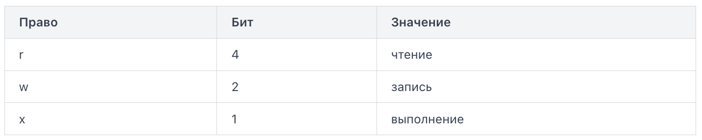

Команда chmod (change mode) изменяет права доступа к файлу или каталогу. Она принимает два принципиально разных способа записи: символьный и числовой. Оба делают одно и то же, но удобны в разных ситуациях.

Символьная запись строится по схеме: кому + операция + что.
- Кому: u (владелец), g (группа), o (остальные), a (все сразу)
- Операция: + (добавить), - (убрать), = (установить точно)
- Что: r, w, x

Примеры:
```bash
chmod u+x script.sh       # добавить владельцу право на выполнение
chmod go-w report.txt     # убрать запись у группы и остальных
chmod a+r readme.md       # дать всем право на чтение
chmod u=rwx,go=r file     # владельцу всё, остальным только чтение
```

Если не указать "кому", по умолчанию меняется для всех.

Числовая запись использует восьмеричные числа (octal notation). Каждый бит права имеет числовое значение:



Права для каждой категории суммируются. Три цифры в числе — это владелец, группа, остальные.

Разберём 755:
- 7 = 4+2+1 = rwx (владелец: всё)
- 5 = 4+0+1 = r-x (группа: чтение и выполнение)
- 5 = 4+0+1 = r-x (остальные: чтение и выполнение)

Числовая запись удобна, когда нужно задать права целиком и точно — она всегда перезаписывает все три категории сразу.

