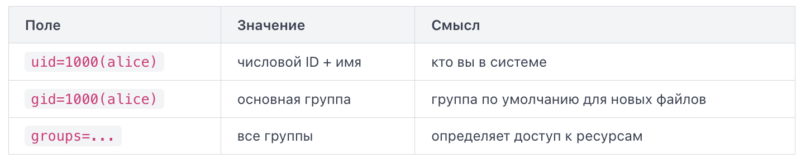

В Linux каждый пользователь — не просто имя. Система работает с числовыми идентификаторами, и именно они определяют, что пользователю разрешено делать.

Команда whoami выводит имя пользователя, от имени которого выполняется текущий сеанс.

Команда id показывает больше: UID (User ID) — числовой идентификатор пользователя, GID (Group ID) — идентификатор основной группы, а также список всех групп, в которые входит пользователь.

UID 0 — это всегда root. Обычные пользователи начинаются с 1000 в большинстве дистрибутивов. Системные пользователи (например, www-data, daemon) занимают диапазон 1–999 и нужны для работы служб, а не для входа в систему.

id можно вызвать с именем пользователя в качестве аргумента.

